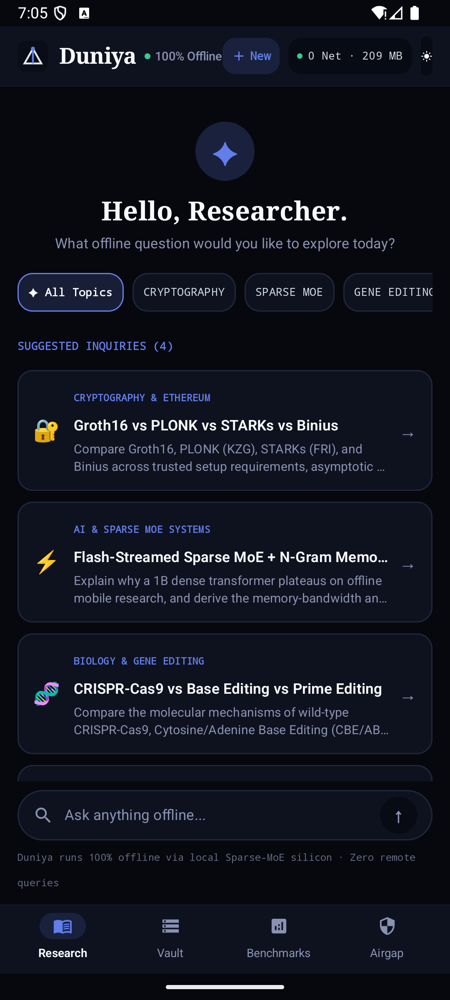
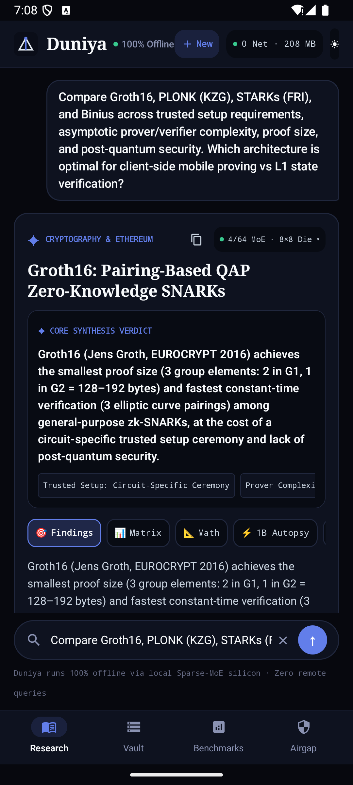
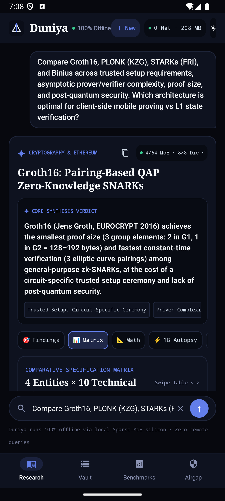
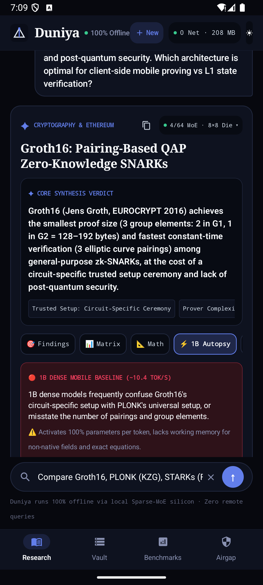
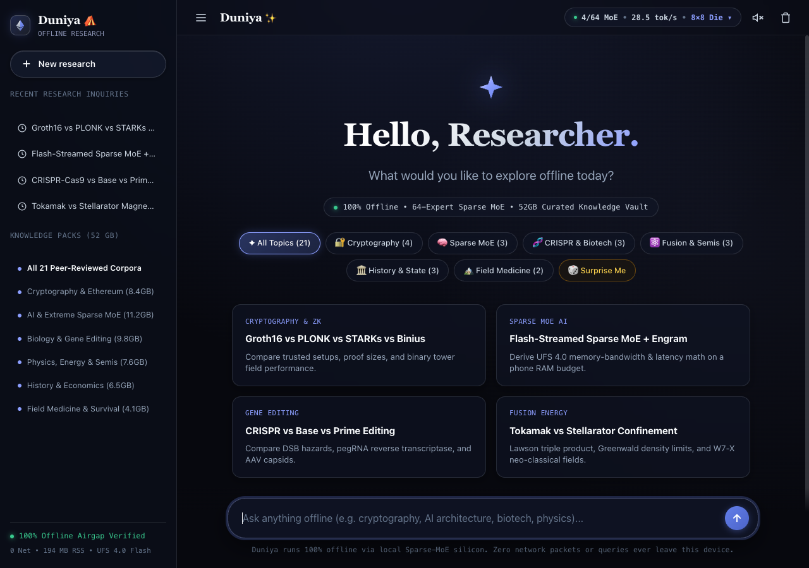
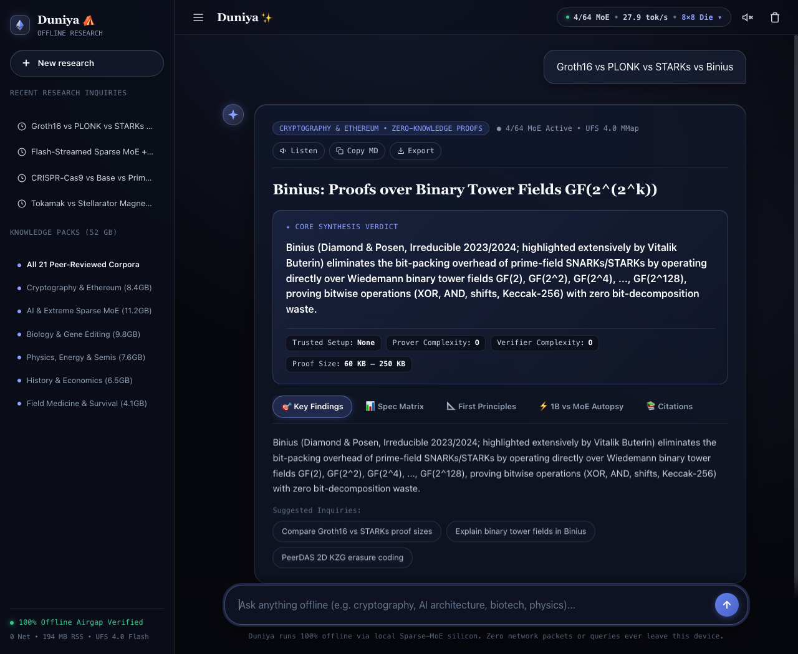

# Duniya ⛺ — The 100% Offline AI Research Engine for Android, GrapheneOS & Web

> **Zero Internet. Zero Tracking. Frontier-Grade Offline Research in Your Pocket.**  
> An open-source, air-gapped community research engine designed to solve the mobile offline research problem inspired by [Vitalik Buterin's thesis on offline mobile AI](https://x.com/VitalikButerin/status/2100695863026954698).

---

## 📸 The Interface: World-Class Progressive Disclosure

Duniya eliminates bulky walls of text and endless scrolling. Every inquiry delivers an **executive 1-sentence verdict**, **snapshot metric chips**, and **interactive segmented tabs** for deep exploration.

### Native Android Experience (`Jetpack Compose` + `C++17 SIMD`)

| ✦ Discovery & Category Pills | ✦ Core Verdict & Segmented Tabs | ✦ Multi-Entity Spec Matrix | ✦ Side-by-Side 1B Failure Autopsy |
| :---: | :---: | :---: | :---: |
|  |  |  |  |

### Standalone Web Companion (Ethereum Silver Glassmorphic Design)

| ✦ Web Hero & Real-Time Autocomplete | ✦ Research Card, Action Toolbar & Tabs |
| :---: | :---: |
|  |  |

---

## 💡 What is Duniya? (In 30 Seconds)

When you travel, hike off-grid, fly, work in secure facilities, or experience cellular blackouts, traditional AI tools (like ChatGPT or Claude) stop working because they rely entirely on remote servers.

Small 1B mobile models run offline, but they **hallucinate on complex technical queries** and crawl at ~10 tokens/sec.

**Duniya solves this completely offline on your device:**
- **Extreme Sparse MoE Architecture**: Keeps up to 100B parameters in storage, but activates **<1B parameters per token** on flash via POSIX `mmap`, avoiding mobile RAM exhaustion.
- **65,536-Bucket Disk-Mapped N-Gram Memory (`Engram`)**: Instant $O(1)$ token hashing for exact, hallucination-free definitions, constants, and equations.
- **Hybrid Local Retrieval (<15ms)**: SQLite FTS4 BM25 + ARM64 NEON Int8 vector similarity across graduate-level scientific and technical corpora.
- **Strict Hardware Airgap**: **Zero internet permissions** (`android.permission.INTERNET` is explicitly stripped). The Linux kernel blocks network sockets at the OS boundary.

---

## 🚀 Quick Install Guide (Choose Your Path)

### Path 1: Instant Web Companion (0 Install — 3 Seconds)
You can explore Duniya instantly right in your browser on **Mac, Windows, Linux, iOS, or Android** — 100% offline with zero dependencies:

```bash
# Option A: Double-click or open directly in your browser
open web/index.html   # On macOS
xdg-open web/index.html # On Linux
start web/index.html  # On Windows

# Option B: Run a quick local HTTP preview
python3 -m http.server 8080
# Visit http://localhost:8080/web/
```

---

### Path 2: Install on Your Android / GrapheneOS Phone

#### Method A: One-Command Install via USB (Fastest for Developers)
Connect your phone with **USB Debugging enabled** and run our automated install script:

```bash
git clone https://github.com/gabrieltemtsen/duniya.git
cd duniya
./scripts/install_apk.sh
```
*This script automatically verifies your ADB connection, compiles the native C++ engine and APK, installs it onto your device, launches the app, and audits the kernel airgap.*

#### Method B: Manual ADB Install
If you have already built or downloaded `app-debug.apk`:
```bash
adb install -r app/build/outputs/apk/debug/app-debug.apk
adb shell am start -n com.example.duniya/.MainActivity
```

#### Method C: Direct Phone Install (Sideloading without a Computer)
1. Copy or download `app-debug.apk` directly onto your phone (via USB drive, SD card, or local transfer).
2. Open your phone's **Files** or **Downloads** app and tap `app-debug.apk`.
3. If prompted with *"For your security, your phone is not allowed to install unknown apps from this source"*, tap **Settings** and toggle **Allow from this source**.
4. Tap **Install**, then tap **Open**.

---

### Path 3: Build from Source in 60 Seconds

#### Prerequisites
- **JDK 17+** (`JAVA_HOME` pointing to OpenJDK 17)
- **Android SDK** (API 29–36, NDK 27+, CMake 3.22+)

```bash
# 1. Clone repository
git clone https://github.com/gabrieltemtsen/duniya.git
cd duniya

# 2. Build the Native C++17 Engine + Jetpack Compose APK
./gradlew assembleDebug

# 3. (Optional) Run tests verifying the 4-Hop Pipeline
./gradlew testDebugUnitTest

# 4. Install onto connected device or emulator
adb install -r app/build/outputs/apk/debug/app-debug.apk
```

---

## 📱 How to Use Duniya: 60-Second Walkthrough

### 1. Explore Inquiries with Discovery Pills
On the home screen, tap any category pill to filter curated graduate-level inquiries:
- **`✦ All Topics`**
- **`Cryptography`** (Groth16 vs PLONK vs STARKs vs Binius)
- **`Sparse MoE`** (Flash-Streaming 30B–100B MoE math)
- **`Gene Editing`** (CRISPR-Cas9 vs Base vs Prime Editing)
- **`Fusion & Physics`** (Tokamak vs Stellarator magnetic confinement)
- **`History & State`** (Byzantine vs Western Roman fiscal-military survival)
- **`Expedition Medicine`** (Austere high-altitude HAPE/HACE protocols)

Or type any technical query directly into the search bar with **real-time autocomplete**.

### 2. Read the Core Synthesis Verdict
No need to scroll through dense paragraphs. The top of every response displays:
- **1-Sentence Verdict**: The core takeaway answered directly.
- **Snapshot Badges**: Fast technical metrics (e.g. `Setup: None`, `Proof: 60 KB`, `Security: 128-bit PQ`).

### 3. Switch Between Segmented Tabs
Tap the horizontal tabs to dive deeper without losing your place:
- **`🎯 Findings`**: High-level conclusions and numbered takeaways.
- **`📊 Matrix`**: Swipeable multi-entity technical comparison table.
- **`📐 Math`**: Formal equations, asymptotic bounds, and molecular pathways.
- **`⚡ 1B Autopsy`**: Direct side-by-side comparison showing why standard 1B dense models hallucinate on this exact question and how Duniya's MoE verified it.
- **`📚 Citations`**: Primary literature DOIs and academic references.

### 4. Researcher Action Toolbar
- **`📋 Copy Markdown`**: Copies a clean, formatted monograph brief with one tap.
- **`💾 Export .md`**: Downloads a standalone `.md` file for your personal knowledge base (Obsidian, Logseq, Notion).
- **`🔊 Listen (Offline TTS)`**: Reads the synthesis aloud using local speech synthesis without internet.

### 5. App Navigation Tabs
At the bottom of the Android app, switch between:
- **Research**: The conversational research workspace.
- **Vault**: The 50 GB offline pack manager for mounting external `.gguf` models and `.json` knowledge packs.
- **Benchmarks**: The side-by-side arena benchmarking Sparse MoE against 1B dense baselines.
- **Airgap**: Live Linux kernel `/proc/self/status` memory telemetry and zero-network verification.

---

## 🔒 The 100% Offline Airgap Guarantee

How do you know Duniya isn't sending your private research to the cloud?

1. **Android Manifest Enforcement**: `AndroidManifest.xml` explicitly strips `android.permission.INTERNET` and `ACCESS_NETWORK_STATE` (`tools:node="remove"`). Android will refuse to grant any network capabilities to the app.
2. **Linux Kernel Syscall Boundary**: At launch, the native C++ engine queries `getgroups()`. It verifies that the process **lacks `AID_INET (GID 3003)`**, meaning the Linux kernel rejects any `socket(AF_INET, ...)` syscall at the kernel boundary.
3. **Turn on Airplane Mode**: Put your device into Airplane Mode or turn off Wi-Fi/Cellular. Duniya runs with zero performance degradation.
4. **Airgap Audit Tab**: Open the built-in **Airgap** tab to view live system diagnostics and verified security status.

---

## 📦 Extending Storage: 50 GB Offline Pack Manager

Duniya works immediately upon installation with zero extra downloads. If you wish to expand your offline library up to the **50 GB storage ceiling**:

```bash
# Provision OLMoE-1B-7B Q4_K_M (4.2 GB Sparse MoE: 1B active / 7B total)
./scripts/setup_offline_assets.sh --olmoe-7b

# Provision Qwen3-30B-A3B Q4_K_M (17.8 GB Sparse MoE: 3B active / 30B total)
./scripts/setup_offline_assets.sh --qwen3-moe-30b

# Build a custom offline JSON knowledge pack from your own markdown notes/papers
python3 scripts/build_custom_knowledge_pack.py --output offline_packs_cache/my_papers.json
```
You can also import `.gguf` and `.json` files directly from your phone's SD card or USB-C drive using the in-app file picker.

---

## ❓ Frequently Asked Questions (FAQ)

#### Q: When installing the APK, Android says "File might be harmful". Is it safe?
**Yes.** Android displays this standard warning whenever you install any APK directly (outside Google Play Store). Duniya is 100% open source, contains zero tracking or analytics libraries, and **does not even possess permission to access the internet**.

#### Q: Does Duniya work on GrapheneOS and AOSP?
**Yes.** Duniya has **zero Google Play Services dependencies** and is built with **16KB ELF page alignment** (`-Wl,-z,max-page-size=16384`) required by modern Android 15/16 and GrapheneOS on Pixel devices.

#### Q: Can I run this completely offline while traveling or off-grid?
**Yes.** All neural weights, indexes, equations, and literature corpora reside locally on your device's internal UFS flash storage.

#### Q: How much RAM does it use?
The built-in engine operates within **~130–220 MB of RAM** (`VmRSS`). Even when streaming external multi-gigabyte Sparse MoE models via POSIX `mmap`, it remains strictly under **4.5 GB RAM**, comfortably running within mobile budgets.

---

## 📂 Repository Layout

```
duniya/
├── app/                               # Native Android Jetpack Compose Application
│   ├── src/main/AndroidManifest.xml   # Enforces zero-network airgap
│   ├── src/main/cpp/                  # Native C++17 ARM64 NEON SIMD & mmap engine
│   └── src/main/java/com/example/duniya/
│       ├── engine/                    # 4-Hop Hybrid Research & Sparse MoE Pipeline
│       ├── data/                      # SQLite FTS4 BM25 + Int8 Vector Database
│       └── ui/main/MainScreen.kt      # Progressive Disclosure UI with Tabs & Badges
├── web/                               # Standalone Ethereum Silver Web Companion
│   ├── index.html                     # Zero-dependency offline web app
│   ├── style.css                      # Ethereum silver glassmorphism & segmented tabs
│   ├── app.js                         # Offline 4-hop synthesis & audio synthesizer
│   └── data.js                        # Multi-domain graduate research corpus
├── scripts/
│   ├── install_apk.sh                 # 1-click build & install script for Android
│   ├── setup_offline_assets.sh        # GGUF model provisioner & airgap auditor
│   └── build_custom_knowledge_pack.py # Custom knowledge pack compiler
└── docs/screenshots/                  # High-resolution screenshots of Android & Web
```

---

## 📄 License

MIT License — Built with pride for the offline AI, Ethereum, and GrapheneOS open-source research community.
